# ioBroker.lg-webos

[Back to README](/README.md)

# Info

Some states don't work on older TVs. Unfortunately, I don't have information on which function is available in each manufacturing year. Please report your model in the forum.

# Summary

- [Instance Settings](#instance-setting)
- [Key objects](#key-objects)
- [Cusor objects](#cursor-objects)
- [Notify objects](#notify-objects)
- [Own request objects)](#own-request-objects)
- [State objects](#state-objects)
- [Status objects](#status-object)
- [System objects](#system-objects)
- [Settings objects](#setting-objects)
- [Blockly](#blockly)
- [Known endpoints](#known-endpoints)
- [Javascript sendTo](#example-javascript-sendto)
- [Javascript sendTo direct request](#example-javascript-sendto-direct-request)
- [Example response](#example-tv-response-lg-2024)

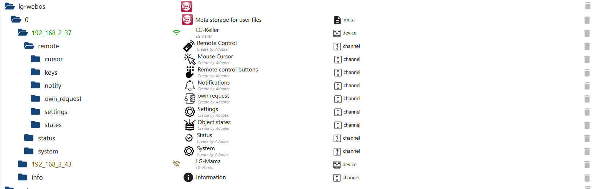

### Instance Setting

[Summary](#summary)

- `Active`: Enabled or disabled TV
- `Connection`: wss for SSL Connection
- `TV name`: LG name
- `IP`: LG IP
- `MAC`: LG MAC for wake on lan - Turn on TV - Does the TV need to support
- `Interval`: This isn't actually needed, as power changes are handled automatically by the TV. If the TV is switched off and the `status.online` status doesn't change, enter an interval here. This will then check whether the TV is switched on or off.
- `LUNA`: A normal LUNA request works without a workaround on some TVs, but there are newer models that require this workaround. This is only needed for sendTo or Own-Request.
- `Old Commands`: Some devices require a different endpoint for screen_on, screen_off, or reboot_soft. It's also possible that the TV doesn't support either of these.
- `Picture`: After the initial connection, possible settings are written to `status.possibleSettings` (objects are created under Settings). If settings are listed there, you can try changing them. If no settings are possible, with or without the checkboxes, then LUNA must be enabled. The 55NANO81T6A TV I'm familiar with only supports LUNA requests with a workaround.

`Picture` without checkmark: luna://com.webos.settingsservice/setSystemSettings
`Picture` with checkmark: ssap://settings/setSystemSettings
`Picture` without checkmark and LUNA active: Workaround for Luna Request via Toast Notification

```json
[
    "contrast",
    "backlight",
    "brightness",
    "color",
    "energySaving",
    "pictureMode",
    "sharpness",
    "dynamicContrast",
    "peakBrightness",
    "gamma",
    "motionEyeCare",
    "colorGamut",
    "hdrDynamicToneMapping",
    "blackLevel",
    "realCinema",
    "tint",
    "noiseReduction",
    "mpegNoiseReduction",
    "smoothGradation",
    "dynamicColor",
    "eyeComfortMode"
]
```

    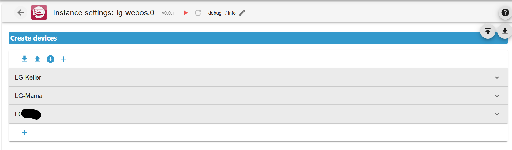

### Key objects

[Summary](#summary)

| Object                      | Short description                                  |
| --------------------------- | -------------------------------------------------- |
| remote.keys.amazon          | Opening Amazon Prime (if available)                |
| remote.keys.amazonAlexa     | Opening Alexa (if available)                       |
| remote.keys.appletv         | Opening Apple-TV (if available)                    |
| remote.keys.asterisk        | Literally just an "\*"                             |
| remote.keys.back            | Back key                                           |
| remote.keys.blue            | Blue key                                           |
| remote.keys.cc              | Closed captioning                                  |
| remote.keys.channelDown     | Channel down key                                   |
| remote.keys.channelUp       | Channel up key                                     |
| remote.keys.closeLaunch     | Close Launch                                       |
| remote.keys.closeWebApp     | Close Web APP                                      |
| remote.keys.dash            | The right side menu that appears with Live button  |
| remote.keys.digit0          | Digit 0                                            |
| remote.keys.digit1          | Digit 1                                            |
| remote.keys.digit2          | Digit 2                                            |
| remote.keys.digit3          | Digit 3                                            |
| remote.keys.digit4          | Digit 4                                            |
| remote.keys.digit5          | Digit 5                                            |
| remote.keys.digit6          | Digit 6                                            |
| remote.keys.digit7          | Digit 7                                            |
| remote.keys.digit8          | Digit 8                                            |
| remote.keys.digit9          | Digit 9                                            |
| remote.keys.disneyPlus      | Opening Disney+ (if available)                     |
| remote.keys.down            | Down Key                                           |
| remote.keys.enter           | Enter or OK key                                    |
| remote.keys.exit            | Exit key                                           |
| remote.keys.fastForward     | Media fast forward key                             |
| remote.keys.green           | Green key                                          |
| remote.keys.home            | Home key                                           |
| remote.keys.joyn            | Opening Joyn (if available)                        |
| remote.keys.left            | Left key                                           |
| remote.keys.menu            | Menu                                               |
| remote.keys.netflix         | Opening Netflix (if available)                     |
| remote.keys.pause           | Media pause key                                    |
| remote.keys.play            | Media play key                                     |
| remote.keys.powerOff        | Turn off TV key                                    |
| remote.keys.powerOn         | Turn on TV via WOL with Mac address (if available) |
| remote.keys.red             | Red key                                            |
| remote.keys.rewind          | Media rewind key                                   |
| remote.keys.right           | Right key                                          |
| remote.keys.rtlPlus         | Opening RTL+ (if available)                        |
| remote.keys.screenOff       | Turn off Screen (if available)                     |
| remote.keys.screenOn        | Turn on Screen (if available)                      |
| remote.keys.screenSaver     | Turn on Screen Saver                               |
| remote.keys.screenshot      | Create screenshot (will be saved under "File")     |
| remote.keys.showInputPicker | Show input picker UI                               |
| remote.keys.stop            | Media stop key                                     |
| remote.keys.up              | Up key                                             |
| remote.keys.volumeDown      | Volumen down key                                   |
| remote.keys.volumeUp        | Volumen up key                                     |
| remote.keys.yellow          | Yellow key                                         |
| remote.keys.youtube         | Opening YouTube (if available)                     |

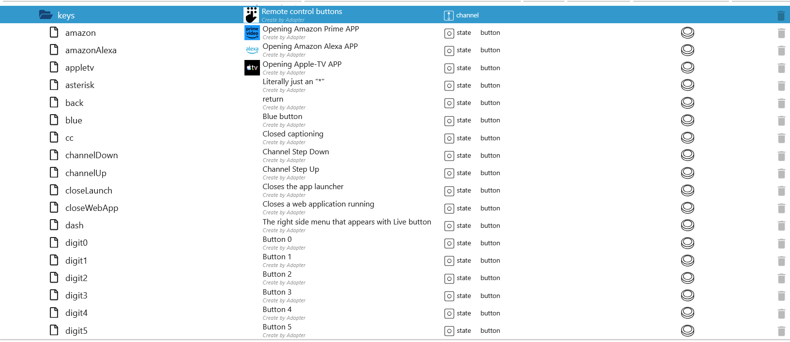<br>
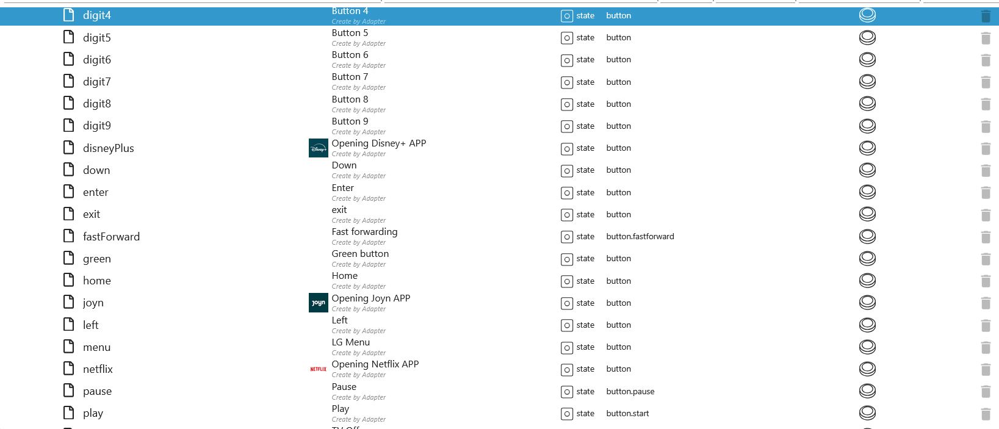<br>
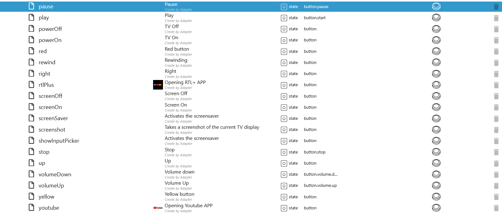

### Cursor objects

[Summary](#summary)

| Object               | Short description                           |
| -------------------- | ------------------------------------------- |
| remote.cursor.click  | Mouse Cursor click (OK key)                 |
| remote.cursor.drag   | Mouse Cursor drag e.g. 10,10,drag or 10,10, |
| remote.cursor.scroll | Mouse Cursor scroll e.g. 10,10              |

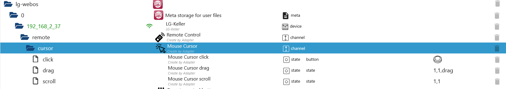

### Notify objects

[Summary](#summary)

| Object                    | Short description                                       |
| ------------------------- | ------------------------------------------------------- |
| remote.notify.closeAlert  | Close alert notification (Not available for all TVs)    |
| remote.notify.closeToast  | Close toast notification (Not available for all TVs)    |
| remote.notify.createAlert | Create a alert notification (Not available for all TVs) |
| remote.notify.createToast | Create a toast notification                             |

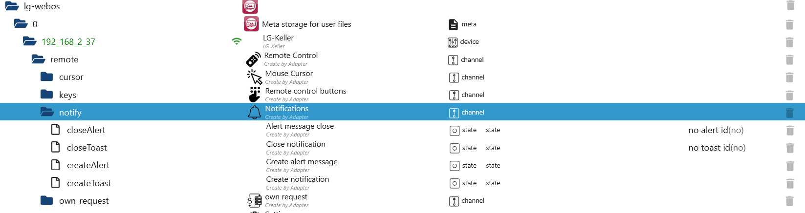

### Own request objects

[Summary](#summary)

| Object                               | Short description       |
| ------------------------------------ | ----------------------- |
| remote.own_request.request           | Sends request           |
| remote.own_request.response          | Response to the request |
| remote.own_request.responseSubscribe | All response from LG TV |

- `remote.own_request.request`

```json
{
    type: "request",
    uri: "com.webos.service.ime/sendEnterKey",
    payload: { name: "1" },
    prefix: "ssap://",
}

{
    type: "request",
    uri: "system/getSystemInfo",
    payload: {},
    prefix: "ssap://",
}
```

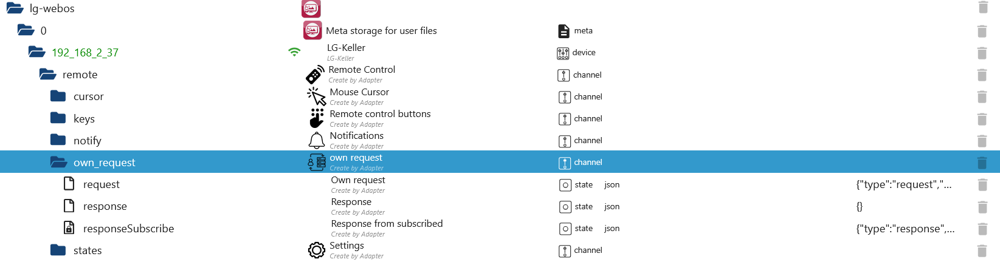

### State objects

[Summary](#summary)

| Object                        | Short description                                          |
| ----------------------------- | ---------------------------------------------------------- |
| remote.states.3dmode          | Enabled/disabled 3D Mode (Not available for all TVs)       |
| remote.states.channel         | Select channel with channel number                         |
| remote.states.channelId       | Select channel with channel ID (e.g. 7_68_525_525_3_9_133) |
| remote.states.channelModel    | Info channel model                                         |
| remote.states.channelName     | Info channel name                                          |
| remote.states.channelType     | Info channel type                                          |
| remote.states.deleteText      | Sends a delete key press                                   |
| remote.states.input           | Select input                                               |
| remote.states.insertText      | Inserts text into the currently focused input field        |
| remote.states.launch          | Select APP for open it                                     |
| remote.states.mdnLog          | Enabled MDN Log (find TV on network)                       |
| remote.states.mute            | Enabled/disabled mute                                      |
| remote.states.openURL         | Open URL in browser                                        |
| remote.states.programDesc     | Program Description                                        |
| remote.states.programDuration | Duration                                                   |
| remote.states.programEnd      | Program end                                                |
| remote.states.programId       | Program Id                                                 |
| remote.states.programName     | Program name                                               |
| remote.states.programStart    | Program start                                              |
| remote.states.soundOutput     | Select sound output                                        |
| remote.states.volume          | Adjust the volume (between 0-100)                          |

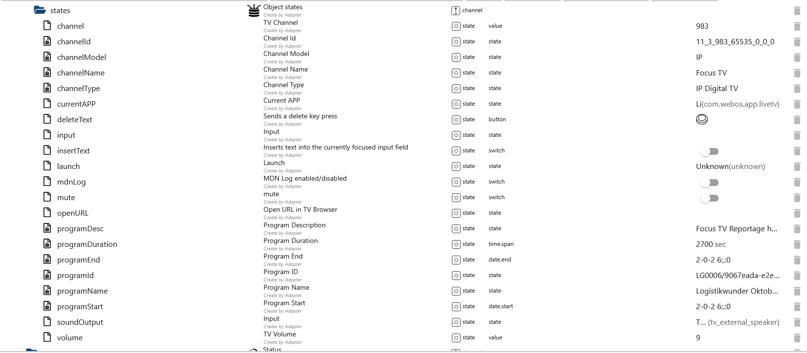

### Status object

[Summary](#summary)

| Object                   | Short description                                        |
| ------------------------ | -------------------------------------------------------- |
| status.online            | TV status on/off                                         |
| status.pointerConnection | Connection for button requests                           |
| status.possibleSettings  | Possible system settings (if empty, then there are none) |
| status.powerState        | Power State                                              |
| status.responseStart     | TV response after the start                              |

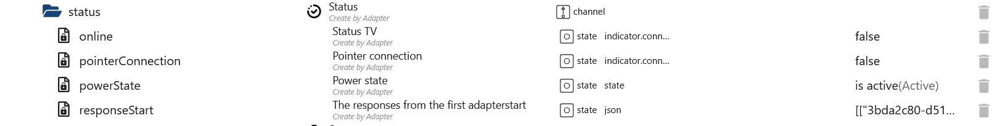

### System objects

[Summary](#summary)

| Object               | Short description                         |
| -------------------- | ----------------------------------------- |
| system.country       | Country                                   |
| system.language_code | Language                                  |
| system.mac           | MAC address                               |
| system.major_ver     | Firmware major version                    |
| system.minor_ver     | Firmware minor version                    |
| system.modelName     | TV name (Not available for all TVs)       |
| system.model_name    | Model name                                |
| system.pair_code     | Pairing key                               |
| system.product_name  | Product name                              |
| system.receiverType  | Receiver Type (Not available for all TVs) |
| system.serialNumber  | Serial number (Not available for all TVs) |

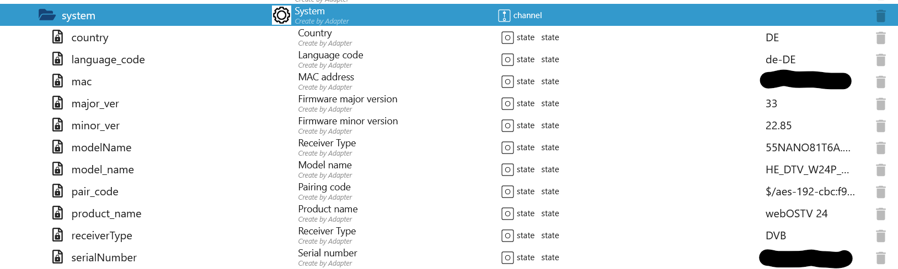

### Setting objects

[Summary](#summary)

| Object                                | Short description        |
| ------------------------------------- | ------------------------ |
| remote.settings.backlight             | Backlight                |
| remote.settings.blackLevel            | Black level              |
| remote.settings.brightness            | Brightness               |
| remote.settings.color                 | Color                    |
| remote.settings.colorGamut            | Color gamut              |
| remote.settings.contrast              | Contrast                 |
| remote.settings.deviceName            | Device Name              |
| remote.settings.dynamicColor          | Dynamic Color            |
| remote.settings.dynamicContrast       | Dynamic contrast         |
| remote.settings.energySaving          | Energy Saving            |
| remote.settings.eyeComfortMode        | Eye Comfort Mode         |
| remote.settings.gamma                 | Gamma                    |
| remote.settings.hdrDynamicToneMapping | HDR dynamic tone mapping |
| remote.settings.motionEyeCare         | Motion eye Care          |
| remote.settings.mpegNoiseReduction    | MPEG noise reduction     |
| remote.settings.noiseReduction        | Noise reduction          |
| remote.settings.peakBrightness        | Peak brightness          |
| remote.settings.pictureMode           | Picture Mode             |
| remote.settings.realCinema            | Real cinema              |
| remote.settings.sharpness             | Sharpness                |
| remote.settings.smoothGradation       | Amooth gradation         |
| remote.settings.tint                  | Tint                     |
| remote.settings.wolwowlOnOff          | Wake on lan On/Off       |

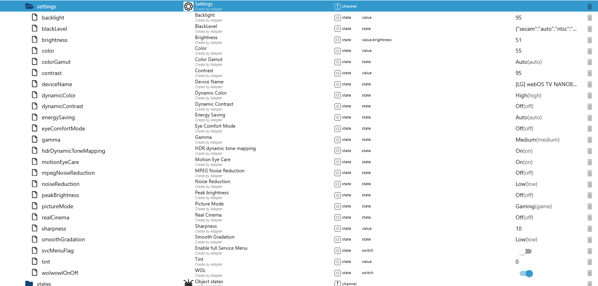

### Blockly

[Summary](#summary)

- `LG-WebOS` Select lg-webos instance
- `TV select` Select TV or send message to all TVs
- `Type` Type "request" or "subscribe"
- `URI` Endpoint
- `Payload` default = {}
- `Prefix` Default = "ssap://" - For LUNA.. request use "luna://"
- `with Result` With TV response

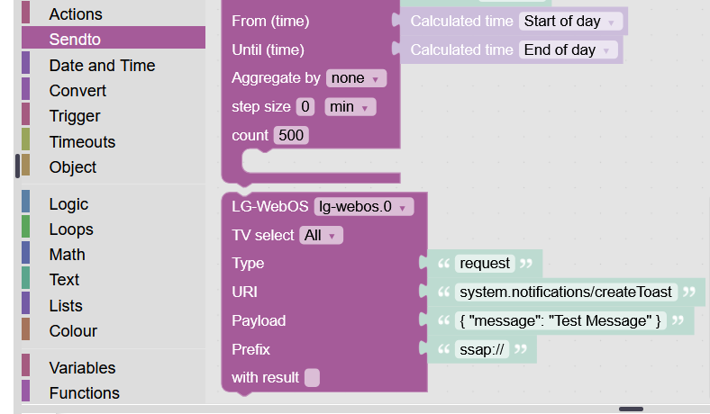<br>
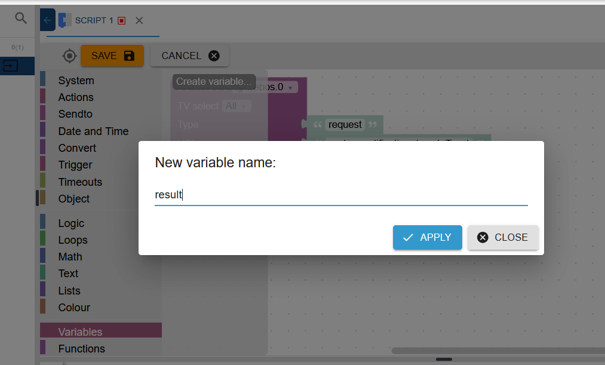<br>
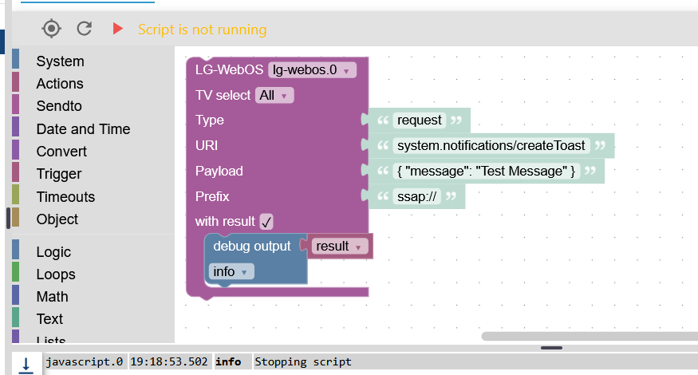

### Known endpoints

[Summary](#summary)

```json
{
    "GET_SERVICES": "api/getServiceList",
    "GET_AUDIO_STATUS": "audio/getStatus",
    "GET_AUDIO_MUTE": "audio/getMute",
    "GET_VOLUME": "audio/getVolume",
    "GET_APPS": "com.webos.applicationManager/listLaunchPoints",
    "GET_APPS_ALL": "com.webos.applicationManager/listApps",
    "GET_APP_STATUS": "com.webos.service.appstatus/getAppStatus",
    "GET_SOFTWARE_INFO": "com.webos.service.update/getCurrentSWInformation",
    "GET_CURRENT_APP_INFO": "com.webos.applicationManager/getForegroundAppInfo",
    "GET_APP_STATE": "system.launcher/getAppState", //"payload":{"id": appId}
    "GET_SYSTEM_INFO": "system/getSystemInfo",
    "GET_SYSTEM_SETTINGS": "settings/getSystemSettings",
    "GET_TV_CHANNELS": "tv/getChannelList",
    "GET_CHANNEL_INFO": "tv/getChannelProgramInfo", //payload":{"channelId":channelId}
    "GET_CURRENT_CHANNEL": "tv/getCurrentChannel",
    "GET_CURRENT_PROGRAM_INFO": "tv/getChannelCurrentProgramInfo",
    "GET_ACR_TOKEN": "tv/getACRAuthToken",
    "GET_INPUTS": "tv/getExternalInputList",
    "GET_CALIBRATION": "externalpq/getExternalPqData",
    "GET_SOUND_OUTPUT": "com.webos.service.apiadapter/audio/getSoundOutput",
    "GET_POWER_STATE": "com.webos.service.tvpower/power/getPowerState",
    "GET_CONFIGS": "config/getConfigs",
    "GET_TV_TIME": "com.webos.service.tv.time/getCurrentTime",
    "GET_3D_STATUS": "com.webos.service.tv.display/get3DStatus",
    "SET_3D_ON": "com.webos.service.tv.display/set3DOn",
    "SET_3D_OFF": "com.webos.service.tv.display/set3DOff",
    "SET_CHANNEL": "tv/openChannel",
    "SET_INPUT": "tv/switchInput", //payload":{ "inputId": "HDMI_1 }
    "SET_VOLUME": "audio/setVolume", //payload":{"volume":value}
    "SET_MUTE": "audio/setMute",
    "SET_SYSTEM_SETTINGS": "settings/setSystemSettings",
    "SET_PIN": "pairing/setPin",
    "SECURE": "com.webos.service.secondscreen.gateway/test/secure",
    "CURSOR_DRAG": "move", //payload":{ dx: dx, dy: dy, drag: 1 or 0 }
    "CURSOR_SCROLL": "scroll", //payload":{ dx: dx, dy: dy }
    "CURSOR_CLICK": "click",
    "VOLUME_UP": "audio/volumeUp",
    "VOLUME_DOWN": "audio/volumeDown",
    "LAUNCH_APP": "com.webos.applicationManager/launch",
    "SEND_ENTER": "com.webos.service.ime/sendEnterKey",
    "SEND_DELETE": "com.webos.service.ime/deleteCharacters", //"payload":{"count":count}
    "INSERT_TEXT": "com.webos.service.ime/insertText", //"payload":{"text":text, "replace":0}
    "SEND_REGISTER": "com.webos.service.ime/registerRemoteKeyboard",
    "MEDIA_PLAY": "media.controls/play",
    "MEDIA_STOP": "media.controls/stop",
    "MEDIA_PAUSE": "media.controls/pause",
    "MEDIA_REWIND": "media.controls/rewind",
    "MEDIA_FAST_FORWARD": "media.controls/fastForward",
    "MEDIA_CLOSE": "media.viewer/close",
    "MEDIA_OPEN": "media.viewer/open",
    "POWER_OFF": "system/turnOff",
    "POWER_ON": "system/turnOn",
    "CREATE_TOAST": "system.notifications/createToast", //"payload":{ message: "Test" }
    "CLOSE_TOAST": "system.notifications/closeToast", //"payload":{ toastId: id }
    "CREATE_ALERT": "system.notifications/createAlert", //"payload":{ message: "Test", buttons: [{ label: "OK" }] }
    "CLOSE_ALERT": "system.notifications/closeAlert", //"payload":{ alertId: id }
    "LAUNCHER_CLOSE": "system.launcher/close",
    "LAUNCH": "system.launcher/launch", //"payload":{"id": appId}
    "OPEN": "system.launcher/open",
    "TV_CHANNEL_DOWN": "tv/channelDown",
    "TV_CHANNEL_UP": "tv/channelUp",
    "TAKE_SCREENSHOT": "tv/executeOneShot",
    "CLOSE_WEB_APP": "webapp/closeWebApp",
    "CONNECT_WEB_APP": "webapp/connectToApp",
    "PIN_IS_WEB_APP": "webapp/isWebAppPinned",
    "LAUNCH_WEB_APP": "webapp/launchWebApp",
    "PIN_WEB_APP": "webapp/pinWebApp",
    "PIN_REMOVE_WEB_APP": "webapp/removePinnedWebApp",
    "INPUT_SOCKET": "com.webos.service.networkinput/getPointerInputSocket",
    "CALIBRATION": "externalpq/setExternalPqData",
    "REQUEST_REBOOT": "com.webos.service.devicereset/requestReboot",
    "CHANGE_SOUND_OUTPUT": "com.webos.service.apiadapter/audio/changeSoundOutput", //"payload":{ output: value }
    "TURN_OFF_SCREEN": "com.webos.service.tvpower/power/turnOffScreen", //"payload":{ standbyMode: "active" }
    "TURN_ON_SCREEN": "com.webos.service.tvpower/power/turnOnScreen", //"payload":{ standbyMode: "active" }
    "TURN_OFF_SCREEN_WO4": "com.webos.service.tv.power/turnOffScreen",
    "TURN_ON_SCREEN_WO4": "com.webos.service.tv.power/turnOnScreen",
    "LIST_DEVICES": "com.webos.service.attachedstoragemanager/listDevices",
    "LUNA_SET_CONFIGS": "com.webos.service.config/setConfigs",
    "LUNA_SET_SYSTEM_SETTINGS": "com.webos.settingsservice/setSystemSettings",
    "LUNA_TURN_ON_SCREEN_SAVER": "com.webos.service.tvpower/power/turnOnScreenSaver",
    "LUNA_SET_PQ_PROPERTIES": "com.webos.service.pqcontroller/setProperties",
    "LUNA_REBOOT_TV": "com.webos.service.tvpower/power/reboot",
    "LUNA_REBOOT_TV_WO4": "com.webos.service.tv.power/reboot",
    "LUNA_SHOW_INPUT_PICKER": "com.webos.surfacemanager/showInputPicker",
    "LUNA_SET_DEVICE_INFO": "com.webos.service.eim/setDeviceInfo",
    "LUNA_EJECT_DEVICE": "com.webos.service.attachedstoragemanager/ejectDevice",
    "LUNA_SET_TPC": "com.webos.service.oledepl/setTemporalPeakControl",
    "LUNA_SET_GSR": "com.webos.service.oledepl/setGlobalStressReduction",
    "LUNA_SET_WHITE_BALANCE": "com.webos.service.pqcontroller/setWhiteBalance"
}
```

### Example Javascript sendTo

[Summary](#summary)

- request: Get or Set Requests
- subscribe: Changes from the endpoint are automatically sent to the adapter.
- unsubscribe: Subscription will be cancelled.
- pointer: These request will not be answered by TV

```
sendTo("lg-webos.0", "sendTV", {
    name: "192.168.2.37", // TV IP or all for all TVs
    type: 'request', // request, subscribe, unsubscribe, pointer
    uri: 'system/getSystemInfo', // Endpoints or Button reuest (button, scroll, move and click)
    payload:  {},
    prefix: 'ssap://',
});
```

```
sendTo("lg-webos.0", "sendTV", {
    name: "192.168.2.37",
    type: 'request',
    uri: 'system/getSystemInfo',
    payload:  {},
    prefix: 'ssap://',
}, async function (result) {
    if (!result) {
        console.log("No result found!");
        return;
    }
    console.log(JSON.stringify(result))
});
```

```
sendTo("lg-webos.0", "sendTV", {
    name: "192.168.2.37",
    type: 'request',
    uri: 'audio/setVolume',
    payload:  { volume: 15 },
    prefix: 'ssap://',
}, async function (result) {
    if (!result) {
        console.log("No result found!");
        return;
    }
    console.log(JSON.stringify(result))
});
```

```
sendTo("lg-webos.0", "sendTV", {
    name: "192.168.2.37",
    type: 'request',
    uri: 'system.notifications/createAlert',
    payload:  {
        message: "This is a test",
        buttons: [{ label: "OK" }],
    },
    prefix: 'ssap://',
}, async function (result) {
    if (!result) {
        console.log("No result found!");
        return;
    }
    console.log(JSON.stringify(result))
});
```

- Button requests receive no response.

```
sendTo("lg-webos.0", "sendTV", {
    name: "192.168.2.37",
    type: 'pointer',
    uri: 'click',
    payload:  {},
});
```

```
sendTo("lg-webos.0", "sendTV", {
    name: "192.168.2.37",
    type: 'pointer',
    uri: 'move',
    payload: {
        dx: 10,
        dy: 10,
        drag: 0, // 0 or 1
    },
});
```

```
sendTo("lg-webos.0", "sendTV", {
    name: "192.168.2.37",
    type: 'pointer',
    uri: 'scroll',
    payload: {
        dx: 10,
        dy: 10,
    },
});
```

```
sendTo("lg-webos.0", "sendTV", {
    name: "192.168.2.37",
    type: 'pointer',
    uri: 'button',
    payload: {
        name: "1", // digits 0-9 - Possible buttons can be found in build/api/helper.js
    },
});
```

```
sendTo("lg-webos.0", "sendTV", {
    name: "192.168.2.37",
    type: 'pointer',
    uri: 'button',
    payload: {
        name: "HOME",
    },
});
```

```
sendTo("lg-webos.0", "sendTV", {
    name: "192.168.2.37",
    type: 'pointer',
    uri: 'button',
    payload: {
        name: "Exit",
    },
});
```

### Example Javascript sendTo direct request

[Summary](#summary)

```
sendTo("lg-webos.0", "sendDirect", {
    name: "192.168.2.37", // TV IP or all for all TVs
    connection: "request",
    send: JSON.stringify({
        id: "501d457b-7eb1-48c1-987e-5535397d98da", // Random 16-bit string
        type: "request", // request, subscribe, unsubscribe or pointer
        uri: "ssap://audio/getStatus",
    }),
}, async function (result) {
    if (!result) {
        console.log("No result found!");
        return;
    }
    console.log(JSON.stringify(result))
});
```

```
sendTo("lg-webos.0", "sendDirect", {
    name: "192.168.2.37", // TV IP or all for all TVs
    connection: "request",
    send: JSON.stringify({
        id: "501d457b-7eb1-48c1-987e-5535397d98da", // Random 16-bit string
        type: "request", // request, subscribe, unsubscribe or pointer
        uri: "ssap://audio/setVolume",
        payload: { volume: "52" },
    }),
}, async function (result) {
    if (!result) {
        console.log("No result found!");
        return;
    }
    console.log(JSON.stringify(result))
});
```

- TV settings e.g. picture - If an error message appears, you can use luna://

```
sendTo("lg-webos.0", "sendDirect", {
    name: "192.168.2.37", // TV IP or all for all TVs
    connection: "request",
    send: JSON.stringify({
        id: "501d457b-7eb1-48c1-987e-5535397d98da", // Random 16-bit string
        type: "request", // request, subscribe, unsubscribe or pointer
        uri: "ssap://settings/setSystemSettings",
        payload: {
            category: "picture",
            settings: { brightness: "52" },
        },
    }),
}, async function (result) {
    if (!result) {
        console.log("No result found!");
        return;
    }
    console.log(JSON.stringify(result))
});
```

- TV settings with luna://

```
const uri: "luna://com.webos.settingsservice/setSystemSettings";
const params: { category: "picture", settings: { brightness: "52" }};
const buttons = [{ label: "", onClick: uri, params: params }];
const payload = {
    message: "Update settings!",
    buttons: buttons,
    onclose: { uri: uri, params: params },
    onfail: { uri: uri, params: params },
};
sendTo("lg-webos.0", "sendDirect", {
    name: "192.168.2.37", // TV IP or all for all TVs
    connection: "request",
    send: JSON.stringify({
        id: "501d457b-7eb1-48c1-987e-5535397d98da", // Random 32-bit string
        type: "request", // request, subscribe, unsubscribe or pointer
        uri: "ssap://system.notifications/createAlert",
        payload: payload,
    }),
}, async function (result) {
    if (!result) {
        console.log("No result found!");
        return;
    }
    console.log(JSON.stringify(result))
    if (result && result.payload && result.payload.alertId) {
        sendTo("lg-webos.0", "sendDirect", {
            name: "192.168.2.37", // TV IP or all for all TVs
            connection: "request",
            send: JSON.stringify({
                id: "501d457b-7eb1-48c1-987e-5535397d98da", // Random 16-bit string
                type: "request", // request, subscribe, unsubscribe or pointer
                uri: "ssap://system.notifications/closeAlert",
                payload: { alertId: result.payload.alertId },
            }),
        }, async function (resp) {
            if (!result) {
                console.log("No result found!");
                return;
            }
            console.log(JSON.stringify(resp))
            if (resp && resp.payload && resp.payload.returnValue) {
                console.log(`Settings brightness OK`)
            }
        });
    }
});
```

```
const type = "button";
const payload = { name: "1" };
const message = Object.keys(payload)
    .reduce(
        (all, param) => {
            return all.concat([`${param}:${payload[param]}`]);
        },
        [`type:${type}`],
    )
    .join("\n");
sendTo("lg-webos.0", "sendDirect", {
    name: "192.168.2.37", // TV IP or all for all TVs
    connection: "pointer",
    send: `${message}\n\n`,
});
```

```
const type = "move";
const payload = {
        dx: 10,
        dy: 10,
        down: 0,
    };
const message = Object.keys(payload)
    .reduce(
        (all, param) => {
            return all.concat([`${param}:${payload[param]}`]);
        },
        [`type:${type}`],
    )
    .join("\n");
sendTo("lg-webos.0", "sendDirect", {
    name: "192.168.2.37", // TV IP or all for all TVs
    connection: "pointer",
    send: `${message}\n\n`,
});
```

### Example TV response (LG 2024)

[Summary](#summary)

- Request com.webos.service.tvpower/power/getPowerState

```json
{
    "type": "response",
    "id": "501d457b-7eb1-48c1-987e-5535397d98da",
    "payload": {
        "state": "Screen Saver",
        "returnValue": true
    }
}
```

```json
{
    "type": "response",
    "id": "8aef499a-f0b0-48a5-9179-f1af2b478c03",
    "payload": {
        "state": "Active",
        "returnValue": true
    }
}
```

```json
{
    "type": "response",
    "id": "34b2ebbc-254d-47d4-9ba5-2d844bcdb7eb",
    "payload": {
        "state": "Screen Off",
        "returnValue": true
    }
}
```

```json
{
    "type": "response",
    "id": "c5a381c1-9719-4213-bb64-3ac43d772482",
    "payload": {
        "returnValue": true,
        "state": "Suspend"
    }
}
```

- TV goes into standby

```json
{
    "type": "error",
    "id": "6b680f03-35ab-40e5-b2bc-3b010aa1e9c9",
    "error": "403 cancelled",
    "payload": {},
    "errorCode": 1
}
```

```json
{
    "type": "response",
    "id": "be6ca32b-94c2-4503-8596-71fb19a4d5a2",
    "payload": {
        "subscribed": true,
        "returnValue": true,
        "appId": "",
        "appCategory": [],
        "processId": "",
        "windowId": ""
    }
}
```

- Set luna:// request

```json
{
    "type": "response",
    "id": "2299d46c-84cd-4aa4-a12a-7992e7d3463d",
    "payload": {
        "returnValue": true,
        "category": "picture",
        "caller": "com.webos.service.apiadapter.pub", // caller is a luna request
        "settings": {
            "brightness": "52"
        }
    }
}
```

- Pairing rejected

```json
{
    "type": "error",
    "id": "4fba9802-b371-4b4e-866d-c2f33bac476e",
    "error": "403 Error: User rejected pairing",
    "payload": {}
}
```

- Pairing accepted

```json
{
    "type": "registered",
    "id": "21fdf139-01aa-4a7b-92fd-8634d76837e1",
    "payload": {
        "client-key": "59ec0ac2faf10c28bdaad462e5fcd7a6"
    }
}
```

- Delete alert or toast notification

```json
{
    "type": "response",
    "id": "1306bb7e-655e-40a5-bb50-7c01f32d4969",
    "payload": {
        "returnValue": true
    }
}
```

```json
{
    "type": "response",
    "id": "6bf0e492-f3e5-4241-9f48-9612a4459311",
    "payload": {
        "pairingType": "PROMPT",
        "returnValue": true
    }
}
```

- Send alert or toast notification

```json
{
    "type": "response",
    "id": "6bf0e492-f3e5-4241-9f48-9612a4459322",
    "payload": {
        "returnValue": true,
        "alertId": "com.webos.service.apiadapter.pub-1767630037688"
    }
}
```

```json
{
    "type": "response",
    "id": "6bf0e492-f3e5-4241-9f48-9612a4459333",
    "payload": {
        "returnValue": true,
        "toastId": "5o9iQ7oj.451-1767630124354"
    }
}
```

- Request: ssap://com.webos.applicationManager/listLaunchPoints

```json
{
    "type": "response",
    "id": "30b960fc-ef3b-425a-abed-af794a7ab379",
    "payload": {
        "subscribed": false,
        "launchPoints": [
            {
                "mediumLargeIcon": "",
                "bgColor": "#4faa6e",
                "installTime": 0,
                "systemApp": true,
                "appDescription": "",
                "launchPointId": "com.webos.app.discovery_default",
                "bgImages": [],
                "lptype": "default",
                "relaunch": false,
                "favicon": "",
                "hidden": false,
                "icon": "https://192.168.2.37:3001/resources/76b4799ce947f9487dc9a9cd8018f2c41b2c6ac0/lgstore.png",
                "removable": false,
                "bgImage": "/mnt/otncabi/usr/palm/applications/com.webos.app.discovery/asset/hd1080/lgstore_preview.png",
                "largeIcon": "https://192.168.2.37:3001/resources/080dedbe2f321a298c456354a6b0f1b8692cf134/lgstore_130x130.png",
                "id": "com.webos.app.discovery",
                "iconColor": "#4faa6e",
                "tileSize": "normal",
                "userData": "",
                "params": {},
                "unmovable": true,
                "extraLargeIcon": "",
                "imageForRecents": "",
                "miniicon": "",
                "title": "Apps",
                "titleVisible": false
            }
            //.......... more data
        ]
    }
}
```

- Request: ssap://api/getServiceList

```json
{
    "type": "error",
    "id": "496a3b0b-0d9b-4c52-8a49-5f3bd6e51b7d",
    "error": "401 insufficient permissions",
    "payload": {}
}
```

- Request: ssap://audio/getStatus

```json
{
    "type": "response",
    "id": "842c2730-421d-4a85-b5f1-634dc39654ea",
    "payload": {
        "returnValue": true,
        "volumeStatus": {
            "volumeLimitable": true,
            "activeStatus": true,
            "maxVolume": 100,
            "ossActivate": false,
            "volumeLimiter": "none",
            "soundOutput": "tv_external_speaker",
            "volume": 9,
            "mode": "normal",
            "externalDeviceControl": false,
            "muteStatus": false,
            "volumeSyncable": false,
            "adjustVolume": true
        },
        "callerId": "com.webos.service.apiadapter",
        "mute": false,
        "volume": 9
    }
}
```

- Request: ssap://com.webos.applicationManager/listApps

```json
{
    "type": "response",
    "id": "0fa179a6-2b27-430b-b2ab-963eb20412ad",
    "payload": {
        "subscribed": true,
        "returnValue": true,
        "apps": [
            {
                "closeOnBackground": false,
                "networkStableTimeout": 0,
                "checkUpdateOnLaunch": true,
                "requiredPermissions": ["all"],
                "class": {
                    "hidden": true
                },
                "title": "AirPlay",
                "allowWidget": false,
                "icon": "https://192.168.2.37:3001/resources/dfefee5435c2faa23f2dc741628241b26c33fc6f/AirPlay_Icon-77x77.png",
                "tileSize": "normal",
                "inAppSetting": false,
                "closeOnRotation": false,
                "nativeLifeCycleInterfaceVersion": 2,
                "folderPath": "/usr/palm/applications/airplay",
                "transparent": false,
                "version": "1.0.0",
                "trustLevel": "trusted",
                "hasPromotion": false,
                "enableCBSPolicy": false,
                "lockable": true,
                "systemApp": true,
                "mediumLargeIcon": "AirPlay_Icon-115x115.png",
                "main": "LunaExecutable",
                "visible": false,
                "privilegedJail": false,
                "inspectable": false,
                "defaultWindowType": "card",
                "vendor": "LG Electronics, Inc.",
                "accessibility": {
                    "supportsAudioGuidance": true
                },
                "deeplinkingParams": "{\"contentTarget\" : \"$CONTENTID\"}",
                "activeFolderPath": "/usr/palm/applications/airplay",
                "type": "native",
                "supportTouchMode": "full",
                "spinnerOnLaunch": true,
                "installTime": 0,
                "disableBackHistoryAPI": false,
                "id": "airplay",
                "enableBackgroundRun": true,
                "handlesRelaunch": false,
                "noSplashOnLaunch": true,
                "useCORSWhitelist": "cors_whitelist.json",
                "removable": false,
                "CPApp": false,
                "uiRevision": 1,
                "unmovable": false
            }
            //.......... more data
        ]
    }
}
```

- Request: ssap://com.webos.service.appstatus/getAppStatus

```json
{
    "type": "error",
    "id": "f29fedd4-21d8-418d-8713-cd2dc1a16db6",
    "error": "404 no such service or method",
    "payload": {}
}
```

- Request: ssap://com.webos.service.update/getCurrentSWInformation

```json
{
    "type": "response",
    "id": "a576a8b8-a428-4c0e-accd-1bb1991c0d14",
    "payload": {
        "returnValue": true,
        "product_name": "webOSTV 24",
        "model_name": "HE_DTV_W24P_AFADATAA",
        "sw_type": "FIRMWARE",
        "major_ver": "33",
        "minor_ver": "22.85",
        "country": "DE",
        "country_group": "EU",
        "device_id": "00:00:00:00:00:00",
        "auth_flag": "N",
        "ignore_disable": "N",
        "eco_info": "01",
        "config_key": "00",
        "language_code": "de-DE"
    }
}
```

- Request: ssap://system/getSystemInfo

```json
{
    "type": "error",
    "id": "08639906-90ca-47cf-b6bb-af9d41801650",
    "error": "401 insufficient permissions",
    "payload": {}
}
```

- Request: ssap://settings/getSystemSettings
- Payload: {"category":"picture","keys":["contrast","backlight","brightness","color"]}

```json
{
    "type": "response",
    "id": "5669f527-2617-4654-be79-a1481bfb65f7",
    "payload": {
        "subscribed": true,
        "category": "picture",
        "settings": { "brightness": "52", "contrast": "95", "color": "55", "backlight": "95" },
        "returnValue": true
    }
}
```

- Request: com.webos.service.tv.time/getCurrentTime

```json
{
    "type": "error",
    "id": "34b51362-28b1-4a06-a465-59478979b6c1",
    "error": "404 no such service or method",
    "payload": {}
}
```

- Request: com.webos.applicationManager/getForegroundAppInfo

```json
{
    "type": "response",
    "id": "def9a3f6-d605-4e3f-99c3-5ebc1463b634",
    "payload": {
        "subscribed": true,
        "returnValue": true,
        "appId": "com.webos.app.home",
        "appCategory": ["home"],
        "processId": "",
        "windowId": ""
    }
}
```

- Request: com.webos.service.apiadapter/audio/getSoundOutput

```json
{
    "type": "response",
    "id": "e8cbd6ff-33f3-4c07-9259-14b6e42edad2",
    "payload": { "soundOutput": "tv_external_speaker", "subscribed": true }
}
```

- Request: audio/getVolume

```json
{
    "type": "response",
    "id": "ef0f5c06-6331-43c6-b5df-7471715100f0",
    "payload": {
        "returnValue": true,
        "volumeStatus": {
            "volumeLimitable": true,
            "activeStatus": true,
            "maxVolume": 100,
            "ossActivate": false,
            "volumeLimiter": "none",
            "soundOutput": "tv_external_speaker",
            "volume": 10,
            "mode": "normal",
            "externalDeviceControl": false,
            "muteStatus": false,
            "volumeSyncable": false,
            "adjustVolume": true
        },
        "callerId": "secondscreen.client"
    }
}
```

- Request: tv/getExternalInputList

```json
{
    "type": "response",
    "id": "a7529998-c2c4-4500-9abc-8c5715e7eabe",
    "payload": {
        "devices": [
            {
                "id": "HDMI_1",
                "label": "HDMI 1",
                "port": 1,
                "connected": false,
                "appId": "com.webos.app.hdmi1",
                "icon": "https://192.168.2.37:3001/resources/7342aa3de853504090941aae037d2b20e5e6a945/HDMI_1.png",
                "forceIcon": false,
                "modified": false,
                "lastUniqueId": -1,
                "hdmiPlugIn": false,
                "hdmiSignalExist": false,
                "subList": [],
                "subCount": 0,
                "favorite": false
            },
            {
                "id": "HDMI_2",
                "label": "HDMI2",
                "port": 2,
                "connected": true,
                "appId": "com.webos.app.hdmi2",
                "icon": "https://192.168.2.37:3001/resources/680509a096d972878b1199e134bf6b5ba397185c/HDMI_2.png",
                "forceIcon": false,
                "modified": false,
                "lastUniqueId": 255,
                "hdmiPlugIn": true,
                "hdmiSignalExist": false,
                "subList": [
                    {
                        "id": "SIMPLINK",
                        "portId": 2,
                        "uniqueId": 8,
                        "vendorId": 3303,
                        "physicalAddress": 8704,
                        "depth": 2,
                        "osdName": "Fire TV Stick",
                        "cecpDevType": 4,
                        "cecpNewType": 9,
                        "cecPower": "Off"
                    }
                ],
                "subCount": 1,
                "favorite": false
            },
            {
                "id": "HDMI_3",
                "label": "HDMI 3",
                "port": 3,
                "connected": false,
                "appId": "com.webos.app.hdmi3",
                "icon": "https://192.168.2.37:3001/resources/704af23fb199a4d2bdfe0c068f9dd81b00cd91ac/HDMI_3.png",
                "forceIcon": false,
                "modified": false,
                "lastUniqueId": -1,
                "hdmiPlugIn": false,
                "hdmiSignalExist": false,
                "subList": [],
                "subCount": 0,
                "favorite": false
            }
        ],
        "subscribed": true
    }
}
```

- Request: tv/getChannelList

```json
{
    "type": "response",
    "id": "0b987876-0c07-4385-9d41-97569a9d61e2",
    "payload": {
        "returnValue": true,
        "ipSatelliteSupport": true,
        "ipChanInteractiveUrl": "https://eic.cdplauncher.lgtvcommon.com/launcher/index.html",
        "verifyDone": true,
        "channelLogoServerUrl": "",
        "valueList": "",
        "channelListCount": 0,
        "ipAntennaSupport": true,
        "dataSource": 2,
        "dataType": 0,
        "ipOPSupport": true,
        "ipCableSupport": true,
        "tuner_channel": { "errorCode": "1010", "returnValue": false, "errorText": "tuner channel map does not exist" },
        "channelList": []
    }
}
```

- Request: com.webos.service.networkinput/getPointerInputSocket

```json
{
    "type": "response",
    "id": "0a353578-00e3-49c3-994b-041a0e962441",
    "payload": {
        "returnValue": true,
        "socketPath": "wss://192.168.2.37:3001/resources/3219ce567e9456ea86a17aa4c4380ce4ff28e49/netinput.pointer.sock"
    }
}
```

- Request: com.webos.service.attachedstoragemanager/listDevices

```json
{
    "type": "response",
    "id": "e5feda54-d228-4128-8887-53ec0f022f3a",
    "payload": {
        "subscribed": false,
        "returnValue": true,
        "devices": [
            {
                "deviceName": "fritz3 Mediaserver",
                "manufacturer": "AVM Berlin",
                "deviceId": "xxx-xxx-xxx-xxx-xxx",
                "deviceType": "dms",
                "deviceUri": "0",
                "modelDescription": "fritz3",
                "ipAddress": "192.168.2.2",
                "thumbnailUri": "http://192.168.2.2:49000/FRITZ-Logo-120x120.png"
            },
            {
                "deviceName": "fritz2 Mediaserver",
                "manufacturer": "AVM Berlin",
                "deviceId": "xxx-xxx-xxx-xxx-xxx",
                "deviceType": "dms",
                "deviceUri": "0",
                "modelDescription": "fritz2",
                "ipAddress": "192.168.2.4",
                "thumbnailUri": "http://192.168.2.4:49000/FRITZ-Logo-120x120.png"
            },
            {
                "deviceName": "fritz1 Mediaserver",
                "manufacturer": "AVM Berlin",
                "deviceId": "xxx-xxx-xxx-xxx-xxx",
                "deviceType": "dms",
                "deviceUri": "0",
                "modelDescription": "fritz1",
                "ipAddress": "192.168.2.3",
                "thumbnailUri": "http://192.168.2.3:49000/FRITZ-Logo-120x120.png"
            },
            {
                "deviceName": "Synology",
                "manufacturer": "Synology Inc",
                "deviceId": "xxx-xxx-xxx-xxx-xxx",
                "deviceType": "dms",
                "deviceUri": "0",
                "modelDescription": "Synology DLNA/UPnP Media Server",
                "ipAddress": "192.168.2.56",
                "thumbnailUri": "http://192.168.2.56:50001/tmp_icon/dmsicon120.png"
            },
            {
                "deviceName": "AVM FRITZ!Mediaserver",
                "manufacturer": "AVM Berlin",
                "deviceId": "xxx-xxx-xxx-xxx-xxx",
                "deviceType": "dms",
                "deviceUri": "0",
                "modelDescription": "FRITZ!Box 5690 Pro",
                "ipAddress": "192.168.2.1",
                "thumbnailUri": "http://192.168.2.1:49000/FRITZ-Logo-120x120.png"
            },
            {
                "deviceType": "internal picturewizard",
                "deviceName": "INTERNAL_STORAGE_PICTUREWIZARD",
                "deviceUri": "/mnt/lg/appstore/preload/picturewizard",
                "deviceId": "INTERNAL_STORAGE_PICTUREWIZARD"
            },
            {
                "deviceType": "internal camera",
                "deviceName": "CAMERA_INTERNAL STORAGE",
                "deviceUri": "/mnt/lg/appstore/cam",
                "deviceId": "INTERNAL_STORAGE_CAMERA"
            },
            {
                "deviceType": "internal samples",
                "deviceName": "SAMPLE INTERNAL STORAGE",
                "deviceUri": "/usr/palm/applications/com.webos.app.mediadiscovery/assets/samples",
                "deviceId": "INTERNAL_STORAGE_SAMPLES"
            }
        ]
    }
}
```

- Request:

```json

```

[Summary](#summary)
